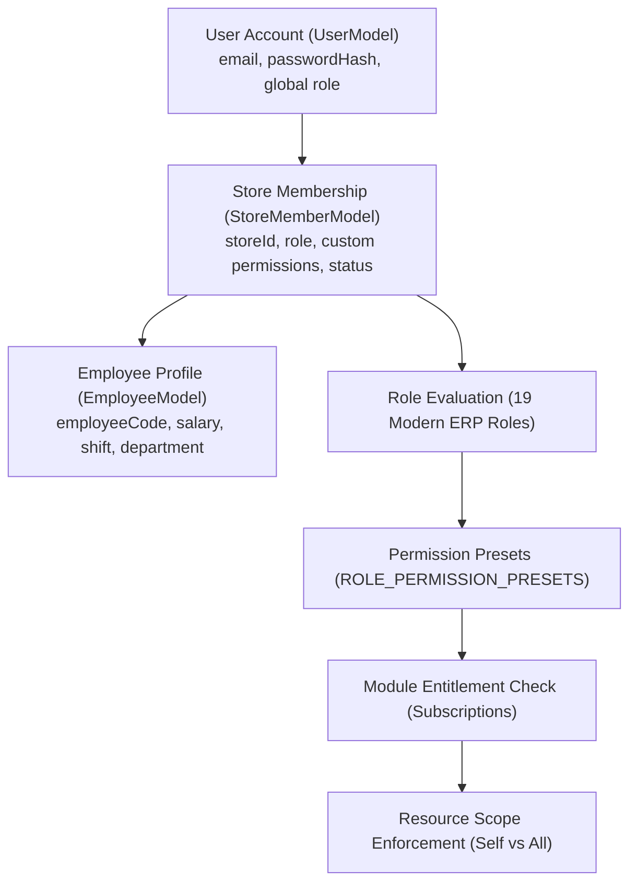

# BornoLand — Master Employee / Member Identity, RBAC & ERP Access Architecture

## 1. Architectural Overview

BornoLand implements an enterprise-grade, multi-layered identity, role, and permission framework designed for modern multi-store retail, ERP, and HRM operating environments.

---

## 2. Core Identity Models & Linkage Strategy

1. **User Identity (`UserModel`)**:
   - The canonical authentication principal.
   - Contains credentials (`passwordHash` with bcrypt), contact info, and global platform status.

2. **Store Membership (`StoreMemberModel`)**:
   - Scoped strictly to `{ storeId, userId }`.
   - Defines the member's store-level role (`owner`, `admin`, `cashier`, `employee`, `accountant`, etc.) and explicit permission grants.
   - Unique compound index on `{ storeId, email }` guarantees no duplicate memberships.

3. **HR Employee Profile (`EmployeeModel`)**:
   - Contains operational HR metadata: `employeeCode` (e.g. `EMP-0042`), `departmentId`, `designationId`, `shiftId`, `salaryStructure`, and `bankInfo`.
   - Referenced directly to `userId` and `storeId`.
   - Index on `{ storeId, employeeCode }` guarantees deterministic and fast profile lookup.

---

## 3. Centralized 19-Role Modern ERP Registry

The platform defines 19 granular ERP roles in `apps/api/src/common/types/permissions.ts`:

| Role Key | Title | Primary Responsibility | Default Post-Login Destination |
|---|---|---|---|
| `owner` | Store Owner | Unrestricted wildcard access (`*`) | `/store/{slug}/dashboard` |
| `admin` | Store Administrator | Complete administrative control over store modules | `/store/{slug}/dashboard` |
| `store_manager` | Store Manager | Store operations, sales, team, reports | `/store/{slug}/dashboard` |
| `hr_manager` | HR Manager | Full HRM, staff profiles, attendance, leaves, payroll | `/store/{slug}/hrm/employees` |
| `hr_staff` | HR Staff | Daily attendance and employee assistance | `/store/{slug}/hrm/employees` |
| `accountant` | Store Accountant | General ledger, journals, reconciliation, financial reports | `/store/{slug}/finance/reports` |
| `finance_manager`| Finance Manager | Strategic financial management, disbursements, billing | `/store/{slug}/finance/reports` |
| `sales_manager` | Sales Manager | Orders, customers, POS supervision, discounts | `/store/{slug}/dashboard` |
| `cashier` | Cashier | Rapid POS counter checkout and order issuance | `/store/{slug}/pos` |
| `inventory_manager`| Inventory Manager| Stock control, purchase orders, warehouses | `/store/{slug}/inventory` |
| `inventory_staff`| Inventory Staff | Stock adjustments, stocktaking, scans | `/store/{slug}/inventory` |
| `warehouse_manager`| Warehouse Manager| Warehouse locations, dispatches, receiving | `/store/{slug}/inventory` |
| `warehouse_staff`| Warehouse Staff | Picking, packing, bin movements | `/store/{slug}/inventory` |
| `purchasing_manager`| Purchasing Manager| Vendor procurement and purchase orders | `/store/{slug}/inventory` |
| `purchasing_staff`| Purchasing Staff| Purchase order creation | `/store/{slug}/inventory` |
| `crm_manager` | CRM Manager | Customer profiles, reviews, engagement | `/store/{slug}/dashboard` |
| `support_agent` | Support Agent | Customer service, order status lookups | `/store/{slug}/dashboard` |
| `marketing_manager`| Marketing Manager| Coupons, campaigns, media banners | `/store/{slug}/dashboard` |
| `employee` | General Employee | Self-service portal: attendance, leave, payslips | `/store/{slug}/hrm/self-service` |

---

## 4. Authentication: Dual Identifier Login

Employees and staff can sign in using either:
1. **Registered Email Address**: `name@company.com`
2. **Assigned Employee Code**: `EMP-0042` or `EMP-0001`

### Security Safeguards
- **Never allow passwordless login**: Whether using Email or Employee ID, valid bcrypt password authentication against `UserModel.passwordHash` is strictly enforced.
- **Server-side Resolution**: If an employee logs in with `EMP-0042`, the backend resolves `EmployeeModel.findOne({ employeeCode })`, retrieves the associated `UserModel`, and verifies the credentials before generating rotating JWT session tokens.
- **Contextual Landing Path**: Upon successful authentication, the server computes the role-appropriate destination (e.g. `/pos` for cashiers, `/hrm/self-service` for employees) and returns it in `defaultLandingPath`.

---

## 5. Employee Self-Service Architecture (`/hrm/self-service`)

### Absolute Tenant & Scoped Isolation
1. **Server-Side Identity Injection**:
   - `store-permission.middleware.ts` inspects the authenticated user, verifies active store membership, resolves the linked `employeeId`, and stores it on `req.storeContext`.
   - The self-service endpoints never trust an `employeeId` or `userId` supplied in the request body or URL query.
2. **Strict Privacy**:
   - An employee can only retrieve their own attendance, apply for their own leaves, and view their own payslips.
   - Cross-employee snooping (`employeeId` tampering in URLs or APIs) is strictly impossible.
3. **Server-Authoritative Clocking**:
   - `clockInMyAttendance` and `clockOutMyAttendance` use the authoritative server time (`new Date()`). Client timestamps cannot be forged.
   - Duplicate clock-ins on the same day are blocked with 400 Bad Request.
   - Clock-out requires a prior clock-in on that date, and automatically computes `workedMinutes` and `overtimeMinutes`.
4. **Official Payslip Document Integration**:
   - Employees can view and print official payslips using the bilingual `PayslipDocument` with zoom, paper size options, and print isolation.
   - Internal cost prices, purchase orders, COGS, and sensitive supplier data are completely scrubbed and inaccessible.
