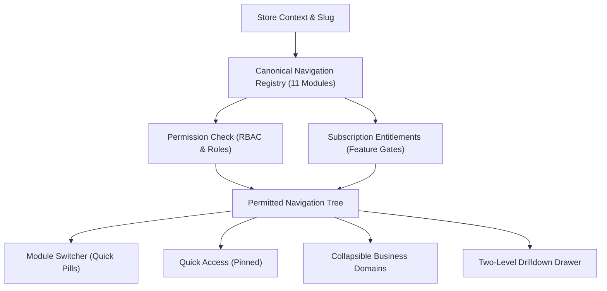

# BornoLand — Premium ERP / E-Commerce / POS / HRM Sidebar & Navigation Architecture

## 1. Executive Summary

The BornoLand dashboard navigation has been elevated from a flat 40+ item link list into a modular, hierarchical Business Operating System (BOS) navigation engine. 

Designed according to world-class enterprise SaaS standards (Stripe, Linear, and modern ERP suites), the navigation is organized strictly around **11 Core Business Modules** rather than individual disparate features.

---

## 2. Canonical 11-Module Business Hierarchy

All store routes are organized by primary business domains in ergonomic operational order:

| # | Module ID | Badge | English Title | Bengali Title | Core Responsibility |
|---|---|---|---|---|---|
| 1 | `home` | 🏠 | Home | হোম | Executive KPI dashboard, revenue graphs, store status |
| 2 | `commerce` | 🛍️ | Commerce | ব্যবসা ও বাণিজ্য | Orders, Customers, Products, Categories, Incomplete Orders, Reviews |
| 3 | `inventory` | 📦 | Inventory | ইনভেন্টরি ও গুদাম | Real-time stock overview, multi-warehouses, stock movement ledger, waste logs |
| 4 | `purchasing` | 🚚 | Purchasing | ক্রয় ও সরবরাহ | Vendor purchase orders (POs), goods receipts, supplier profiles |
| 5 | `pos` | 🧾 | Point of Sale (POS) | পয়েন্ট অব সেল (পিওএস) | Fast retail counter checkout terminal, shift drawer reconciliation |
| 6 | `hrm` | 👥 | People & HRM | কর্মী ও মানবসম্পদ | Staff directory, departments/designations, attendance, leaves, payroll, self-service |
| 7 | `finance` | 💰 | Finance & Accounting | হিসাববিজ্ঞান ও অর্থ | Chart of Accounts, double-entry journal vouchers, expenses, P&L, balance sheets |
| 8 | `growth` | 📈 | Growth & CRM | গ্রোথ ও সিআরএম | CRM deals, support tickets, marketing campaigns, coupons, web analytics |
| 9 | `operations` | ⚙️ | Operations | অপারেশনস | Approval workflows, team tasks, delivery zones, courier booking, payment gateways, taxes |
| 10 | `website` | 🌐 | Store Website | অনলাইন স্টোর ও ওয়েবসাইট | Theme design, menu navigation, custom CMS pages, media library, domain, SEO, FAQ |
| 11 | `system` | ⚙️ | System & Settings | সিস্টেম ও সেটিংস | Store settings, team RBAC permissions, third-party apps, audit activity logs, billing |

---

## 3. Core Architectural Capabilities

### A. Collapsible Modules with Persistence
- Each module header can be expanded or collapsed with subtle micro-animations.
- Expanded states persist in `localStorage` under `bornoland_nav_expanded_modules`.
- The module corresponding to the active route is automatically expanded without jarring layout shifts.

### B. Top Business Module Switcher
- A horizontal pill strip at the top of the sidebar provides immediate one-click jumps between domains (`Commerce`, `Inventory`, `POS`, `HRM`, `Finance`, `Growth`, etc.).
- In desktop collapsed mode, clicking the compass icon opens a Floating UI popover listing all permitted modules and their respective items.

### C. Quick Access / Favorites (Pinning)
- Users can star/pin frequently used screens (e.g. `POS`, `Orders`, `Inventory`, `Payroll`).
- Pins are stored per store in `localStorage` (`bornoland_pinned_${storeId}`).
- Pinned items appear in a dedicated top pill bar for instantaneous access.

### D. Recent Visited Pages
- Automatically tracks the user's latest 5-8 visited store screens.
- Stored per store in `localStorage` (`bornoland_recent_${storeId}`).

### E. Dedicated Module UX Widgets
- **POS**: Prominently highlights the "Open POS Terminal" button and counter status directly inside the sidebar.
- **HRM**: Clearly separates administrative staff records from employee self-service.
- **Finance**: Visually categorizes bookkeeping (COA, Journal, Reports) from operational expenses.

### F. Responsive Mobile Drilldown Drawer
- Replaces overwhelming 40+ item mobile menus with an elegant two-level drill-down:
  1. **Level 1**: Business Domain cards (Commerce, Inventory, POS, HRM, etc.).
  2. **Level 2**: Detailed feature list with a clear "$\leftarrow$ Back to Modules" navigation header.

---

## 4. Security & Role-Based Filtering

Sidebar visibility is strictly enforced through a multi-tier authorization pipeline:

$$\text{Authentication} \rightarrow \text{Tenant Membership} \rightarrow \text{Subscription Entitlement} \rightarrow \text{Role Permissions} \rightarrow \text{Rendered Items}$$

- **Zero Security by Obscurity**: If an unauthorized user directly visits an unentitled route (e.g. `/hrm/payroll`), the backend API and Next.js shell reject the request with HTTP 403 Forbidden.
- **Dynamic Pruning**: If all items in a module are unauthorized for a user's role (e.g. a Cashier has no access to Finance or HRM), the entire module container is completely pruned from the sidebar DOM.

---

## 5. Bilingual Support (English & বাংলা)

Every module, item label, description, and status indicator is natively bilingual. The language switcher instantaneously updates all labels without requiring a page refresh or network round-trip.

| Module | English Label | Bengali Translation |
|---|---|---|
| Commerce | Incomplete Orders | অসম্পূর্ণ অর্ডার |
| Inventory | Stock Movement | স্টক মুভমেন্ট লেজার |
| Purchasing | Purchase Orders | পারচেজ অর্ডার (PO) |
| POS | Registers & Shifts | ক্যাশ রেজিস্টার ও শিফট |
| HRM | Employee Self-Service | কর্মী সেলফ-সার্ভিস |
| Finance | Chart of Accounts | হিসাবের তালিকা (COA) |
| Growth | Support Helpdesk | সাপোর্ট হেল্পডেস্ক |
| Operations | Approval Center | অনুমোদন কেন্দ্র |
| Website | Custom Pages | কাস্টম পেজ |
| System | Team & Permissions | টিম ও পারমিশন |
